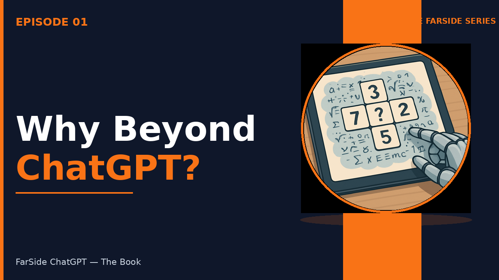
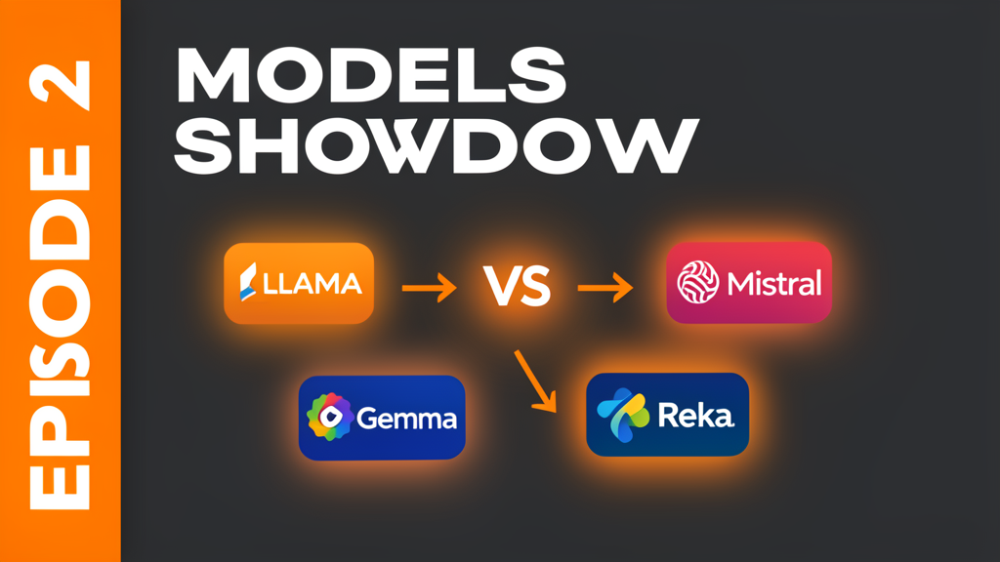
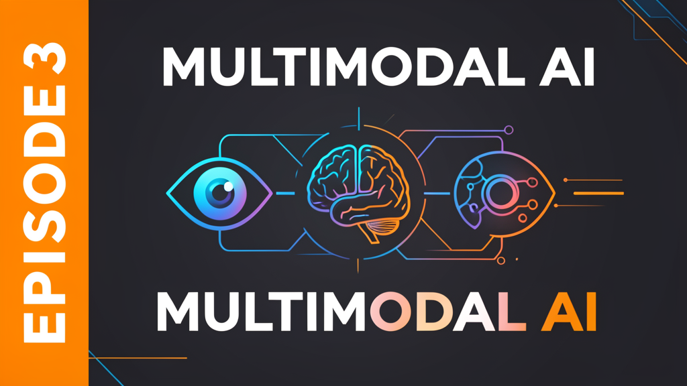
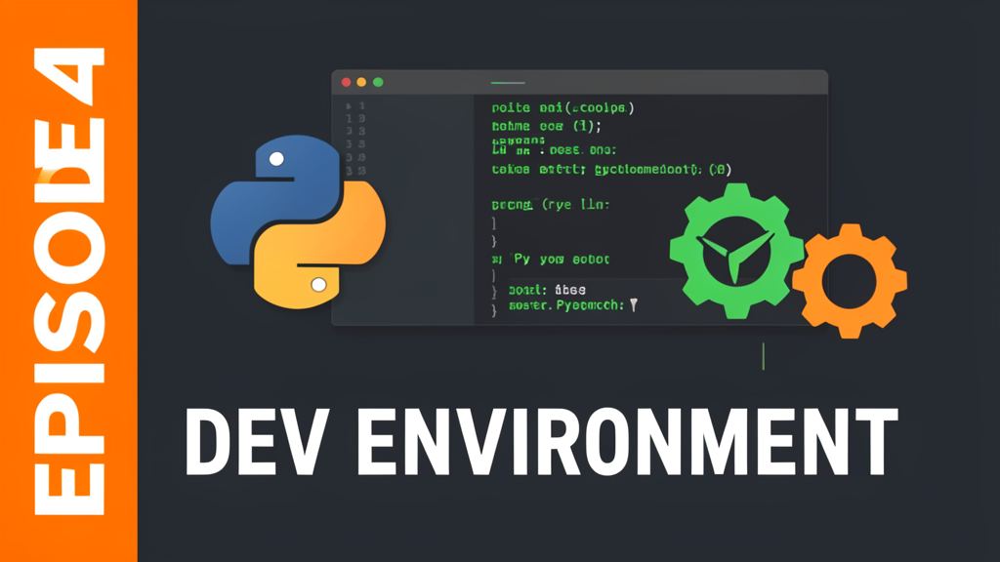
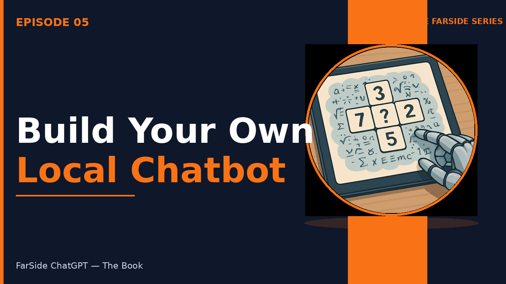
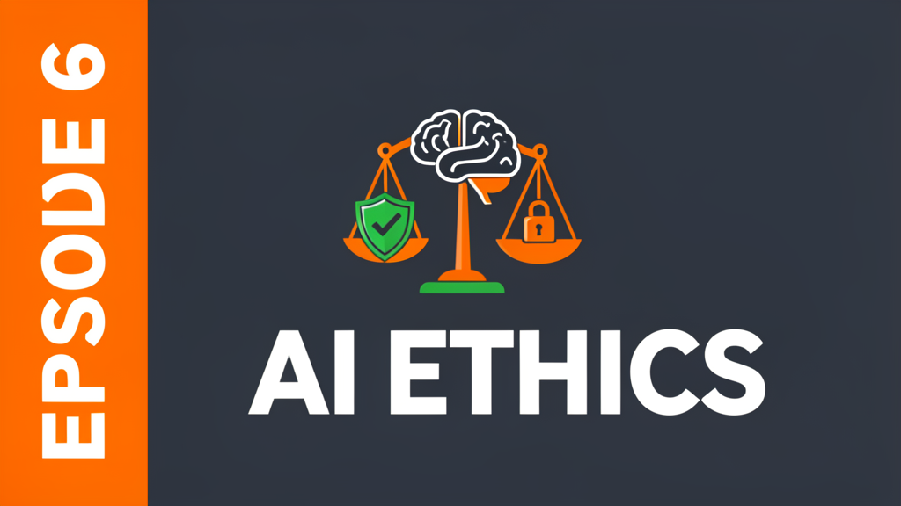
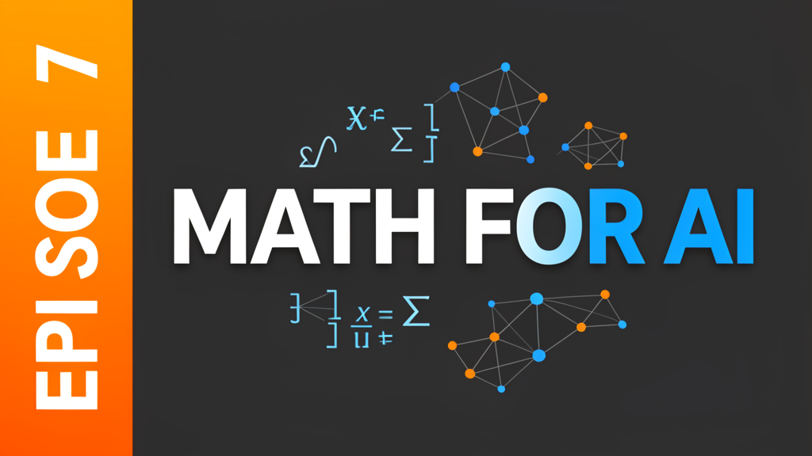
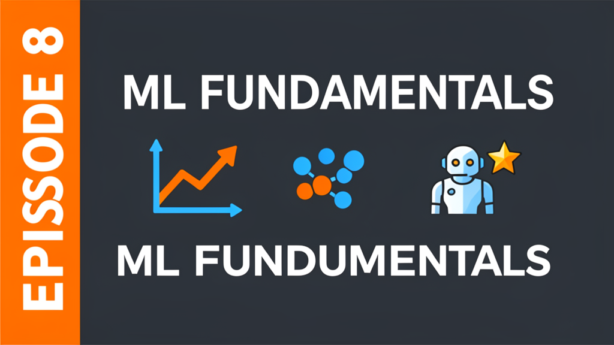

# On The FarSide Series — Companion Code Repository

> Code examples and exercises from the **"On The FarSide Series"** YouTube channel, based on the book **"FarSide ChatGPT"** by the Joomo Enterprises, published by Joomo Enterprises Publishing.

This repository contains all the code examples, exercises, and supplementary materials referenced in the YouTube series. The book covers **14 chapters** with **210+ code examples** and **89 exercises** — this repo organizes them into episode-based modules for easy navigation.

---

## Channel Overview

**On The FarSide Series** is a video demonstration series for the book **"FarSide ChatGPT"** by the Joomo Enterprises (Joomo Enterprises Publishing). The series brings the book's 89 exercises to life — each episode demonstrates chapters from the book with real code demos, practical exercises, and step-by-step walkthroughs.

**About the book:**
- 14 chapters covering the full open-source AI stack
- 210+ code examples (all in this repo)
- 89 hands-on exercises (each demonstrated in a video episode)
- Published by Joomo Enterprises Publishing

**What the videos demonstrate:**
- Setting up a local AI development environment from scratch (Chapter 3-4)
- Comparing and benchmarking LLMs — GPT, Claude, Gemini, LLaMA & more (Chapter 1-2)
- Building multimodal AI applications with text, image, and audio models (Chapter 13)
- Building and deploying your own chatbot with open-source models (Chapter 5)
- AI ethics, bias detection, and responsible development (Chapter 6)
- The math and ML fundamentals that power neural networks (Chapter 7-8)

**Series structure (Phase 1 — Foundation):**
- 8 episodes, each 15-25 minutes
- Every episode has a full script, runnable code, and requirements.txt
- All code tested on consumer hardware (no cloud credits needed)

---

## Episode Guide

### Episode 1: Why Beyond ChatGPT
**Thumbnail:** 

Covers the AI landscape beyond ChatGPT — what's out there, why open-source matters, and how to think about choosing the right tool. Sets the foundation for the entire series.

**Code:** [episodes/episode-01-beyond-chatgpt/](episodes/episode-01-beyond-chatgpt/)

---

### Episode 2: The Model Showdown
**Thumbnail:** 

Head-to-head comparison of major LLMs — GPT-4o, Claude, Gemini, LLaMA, Mistral, Gemma, and more. Benchmarks, pricing, and real-world performance.

**Code:** [episodes/episode-02-model-showdown/](episodes/episode-02-model-showdown/)

---

### Episode 3: Multimodal AI
**Thumbnail:** 

Working with models that handle text, images, audio, and video. Covers vision models, speech-to-text, and the emerging multimodal landscape.

**Code:** [episodes/episode-03-multimodal-ai/](episodes/episode-03-multimodal-ai/)

---

### Episode 4: Setting Up Your Dev Environment
**Thumbnail:** 

Complete walkthrough of setting up an AI development workspace — Python, PyTorch, CUDA, VS Code, and all the tools you need.

**Code:** [episodes/episode-04-dev-environment/](episodes/episode-04-dev-environment/)

---

### Episode 5: Build Your Own Chatbot
**Thumbnail:** 

Step-by-step build of a local chatbot using open-source models. Covers model loading, prompt engineering, and building a Gradio interface.

**Code:** [episodes/episode-05-local-chatbot/](episodes/episode-05-local-chatbot/)

---

### Episode 6: AI Ethics & Bias
**Thumbnail:** 

Exploring bias, safety, alignment, and responsible AI development. How to evaluate models for fairness and build AI systems you can trust.

**Code:** [episodes/episode-06-ai-ethics/](episodes/episode-06-ai-ethics/)

---

### Episode 7: Math for AI
**Thumbnail:** 

The essential math — linear algebra, calculus, probability — explained through code. No PhD required, just practical understanding.

**Code:** [episodes/episode-07-math-for-ai/](episodes/episode-07-math-for-ai/)

---

### Episode 8: ML Fundamentals
**Thumbnail:** 

Core machine learning concepts — supervised, unsupervised, reinforcement learning — with hands-on examples that build on everything from Episodes 1-7.

**Code:** [episodes/episode-08-ml-fundamentals/](episodes/episode-08-ml-fundamentals/)

---

## Quick Start

1. **Clone the repo:**
   ```bash
   git clone git@github.com:joomo-enterprises/Farside-Chatgpt.git
   cd Farside-Chatgpt
   ```

2. **Navigate to an episode:**
   ```bash
   cd episodes/episode-01-beyond-chatgpt
   ```

3. **Install dependencies:**
   ```bash
   pip install -r requirements.txt
   ```

4. **Run the examples:**
   ```bash
   cd src/
   python main.py
   ```

---

## Repository Structure

```
Farside-Chatgpt/
├── README.md                    # This file
├── .gitignore
├── LICENSE
├── CONTRIBUTING.md
├── thumbnails/                  # YouTube episode thumbnails
│   ├── episode-1-why-beyond-chatgpt.png
│   ├── episode-2-models-showdown.png
│   ├── episode-3-multimodal-ai.png
│   ├── episode-4-dev-environment.png
│   ├── episode-5-build-chatbot.png
│   ├── episode-6-ai-ethics.png
│   ├── episode-7-math-for-ai.png
│   └── episode-8-ml-fundamentals.png
├── episodes/                    # Episode code, organized by topic
│   ├── episode-01-beyond-chatgpt/
│   ├── episode-02-model-showdown/
│   ├── episode-03-multimodal-ai/
│   ├── episode-04-dev-environment/
│   ├── episode-05-local-chatbot/
│   ├── episode-06-ai-ethics/
│   ├── episode-07-math-for-ai/
│   ├── episode-08-ml-fundamentals/
│   └── template/                # Template for new episodes
├── shared/                      # Shared utilities across episodes
│   ├── utils.py
│   └── config.py
└── assets/
    └── diagrams/
```

Each episode directory contains:
- `SCRIPT.md` — Full video script and walkthrough
- `src/` — Runnable Python code examples
- `requirements.txt` — Python dependencies

---

## About the Book

**"FarSide ChatGPT: Building the Next Generation of Bundled Open-Source AI Programs"** by the Joomo Enterprises, published by Joomo Enterprises Publishing.

A comprehensive guide spanning 14 chapters:
- The AI landscape and model comparisons
- Multimodal AI (vision, audio, video)
- Development environment setup
- Running models locally
- AI ethics and responsible development
- Mathematical foundations for AI
- Machine learning fundamentals
- And much more...

---

## Contributing

See [CONTRIBUTING.md](./CONTRIBUTING.md) for guidelines on how to contribute code, report issues, or suggest improvements.

---

## License

This project is licensed under the MIT License — see [LICENSE](./LICENSE) for details.

---

## Links

- **YouTube Channel:** On The FarSide Series
- **Book:** FarSide ChatGPT by Joomo Enterprises (Joomo Enterprises Publishing)
- **GitHub:** [joomo-enterprises/Farside-Chatgpt](https://github.com/joomo-enterprises/Farside-Chatgpt)
